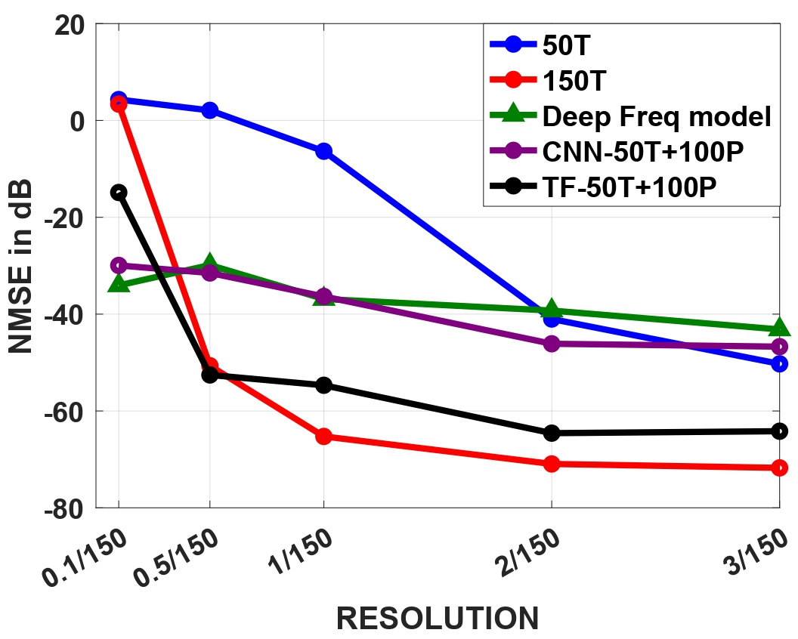

# High Resolution Spectral Estimation

## Author - Omkar Nitsure

**Abstract**—Frequency estimation from measurements corrupted by noise is a challenge across many engineering and scientific fields. Resolution limit of any frequency estimation technique is limited by noise levels and measurement count. The number of measurements are usually small as acquiring them is expensive. This work introduces a machine learning approach on predicting future samples based on available samples. Subsequently, we achieve high resolution frequency estimates by combining provided and predicted measurements. In particular, using only onethird of the total measurements, we achieved performance akin to that obtained with the complete set. Unlike existing learningbased frequency estimators, our approach's output retains full interpretability.

**Index Terms**—high-resolution-spectral-estimation, learnable predictor, ESPRIT, Transformer, bidirectional LSTM, CNN

## Introduction

Frequency estimation involves identifying a set of L
frequencies based on M measurements. This is useful in direction-of-arrival estimation, Doppler frequency shifts in radar and sonar, ultrasound imaging, optical coherence tomography, and nuclear magnetic resonance spectroscopy. Many of these applications require the resolution limit to be as low as possible. This resolution limit decreases with more samples for a given SNR. However, due to practical constraints like cost and power consumption, the number of measurements is often limited. Thus algorithms which can achieve low resolution limits for a given number of measurements are highly desirable.

In theory, 2L samples are both sufficient and necessary to uniquely determine L frequencies when there is no noise using techniques like Prony's algorithm [1]. Although it offers infinite resolution under noise-free conditions, even the smallest amount of noise makes it highly unstable. To enhance robustness in noisy environments, denoising algorithms can be used, but they often require significant computational resources [2], [3].

Research on high-resolution spectral estimation (HRSE)
has introduced various techniques designed to be resilient to noise, as discussed in Chapter 4 of [4]. Here, *high resolution* refers to a level of precision beyond that achievable with the periodogram or Fourier transform-based methods, which are limited by 1/M. Some of the advanced techniques are the multiple signal classification (MUSIC) method [5]–[7],
the estimation of signal parameters using rotational invariance (ESPRIT) [8], and the matrix pencil method [9]. These approaches offer greater robustness and finer resolution than periodogram and annihilating filter methods. The work in
[7] presents a detailed mathematical expression for frequency estimation, illustrating that at moderate to high signal-to-noise ratios (SNRs) error and minimum frequency separation are inversely proportional as M approaches infinity. Achieving high resolution in non-asymptotic conditions or low SNR
signals may require a sufficiently large M.

Most of the HRSE techniques discussed earlier rely on uniformly spaced samples of sinusoidal signals. However, various methods have been developed to estimate frequencies from non-uniform samples [10]–[14]. Some learning-based frequency estimation techniques are also being developed recently. For example, [15] introduced PSnet, a deep-learningbased framework for frequency estimation. Similar to the principles underlying periodogram and root-MUSIC [7], PSnet first learns a pseudo-spectrum from samples, followed by frequency estimation through peak identification within the spectrum. Empirical results demonstrate PSnet's improved performance over both MUSIC and periodogram when the minimum frequency separation is 1/M. A key insight from the paper is that estimating frequencies from a learned frequency representation, like a pseudo-spectrum, proves more effective than training a network to directly estimate frequencies from raw samples, as attempted in [16]. An enhanced version of PSnet was later proposed in [17], which introduced architectural improvements and a learned estimator for determining the number of frequencies L. Notably, these methods were trained and tested on cases with a minimum frequency separation of 1/M, and their performance for resolutions below 1/M has yet to be evaluated.

Some alternative learning strategies assume frequencies lie on a predefined grid, using multilabel classification to address the estimation problem [18]. However, this "on-grid" assumption restricts resolution capabilities. Taking a different approach, other methods focus on learning denoising techniques prior to applying conventional frequency estimation methods [19], [20]. These denoising-based approaches either require training over a broad range of noise levels [19] or need a large volume of training samples [20]. In summary, non-learningbased methods generally need many samples to achieve the desired resolution in noisy environments, while learning-based methods tend to be data-intensive, lack interpretability, and are still limited by the resolution threshold set by the periodogram.

In this work, we introduce a novel data-driven approach for frequency estimation from noisy measurements, designed to achieve high resolution while maintaining interpretability.

Typically, any frequency estimation algorithm demonstrates that, for a set resolution, estimation errors decrease with a higher signal-to-noise ratio (SNR) and/or a greater number of samples. While denoising can help counteract noise, it has intrinsic limitations [2], [20]. Consequently, we focus on increasing the effective sample count to improve accuracy.

Our proposed solution involves a learning-based predictor that extrapolates additional samples from a small, noisy sample set. Specifically, we predict N − M samples from M measurements, where *N > M*. By using both the original M
samples and the predicted ones, we approach the accuracy achievable with N samples. We propose two architectures for this learnable predictor: one based on a long short-term memory (LSTM) convolutional neural network (CNN) and another based on a transformer (TF) encoder [21]. Unlike methods such as those described in [15], [17], [22]–[27], our approach avoids the need to select or design pseudo-spectra, which often lack interpretability in terms of conventional Fourier spectra. Simulations show that with M noisy measurements, our method achieves higher resolution and lower error rates across different SNRs compared to both the HRSE
approach and the method in [17], particularly with the TFbased predictor.

## Problem Formulation

Consider N uniformly spaced samples of a linear combination of complex exponentials, represented as:

$$
x(n) = \sum_{\ell=1}^{L} a_{\ell} \, \exp(\mathrm{j} 2 \pi f_{\ell} \, n) + w(n), \quad n = 1, \cdots, N.
$$

Here, the coefficients aℓ ∈ R are the amplitudes, and fℓ ∈ (0, 0.5] are the normalized frequencies. The term w(n)
represents additive noise, modeled as a zero-mean Gaussian random variable with variance σ 2, with the noise samples being independent and identically distributed. The goal is to estimate the frequencies {fℓ}
L
ℓ=1 from the given measurements.

The accuracy of this estimation is influenced by several factors: the signal-to-noise ratio (SNR), calculated in decibels as $10 \log_{10} \frac{|x(n)|^2}{2N\sigma^2}$; the number of measurements M; and the resolution ∆f , which is the minimum separation between any two frequencies in x(n). Holding the SNR and resolution constant, improving accuracy typically requires a larger number of measurements. Conversely, to maintain a given estimation accuracy and SNR, the achievable resolution for high-resolution spectral estimation (HRSE) methods generally scales to about 1/N if all N measurements are used. However, when it is costly to obtain numerous measurements and only a subset ${x(n)}^{M}_{n=1}$ is available, where *M < N*, the achievable resolution drops to 1/M.

## Learnable Predictor

Utilizing HRSE and other non-learning-based methods to estimate frequencies from a full set of N measurements generally provides good accuracy and resolution. However, this advantage diminishes when only a subset of M (consecutive) samples is available. To address this, we propose a two-stage approach aimed at achieving a resolution closer to 1/N using the available M measurements. In the first stage, we predict samples $`{x(n)}_{n = M+1}^{N}`$ based on the initial measurements $`{x(n)}_{n=1}^{M}`$. The predicted samples are denoted as $`x˜(n)^{N}_{n=M+1}`$. In the second stage, we combine these estimated samples with the original measurements and apply HRSE techniques to estimate the frequencies.

In the initial stage, perfect prediction for x(n) is feasible in the absence of noise [28]. Specifically, for any x(n) as defined in (1), there exists a set of coefficients $`\{c_{k}\}_{k=1}^{K}`$ such that $`x(n)=\sum_{k=1}^{K}c_{k}\,x(n-k)`$ for $`n=K+1,\cdots,N`$, where $`K\geq L`$. When noise is present, the coefficients $`\{c_{k}\}_{k=1}^{L}`$ are estimated using a least-squares approach to minimize the error $`\sum_{n=L+1}^{N}\left|x(n)-\sum_{k=1}^{L}c_{k}\,x(n-k)\right|^{2}`$. However, this predictive method is more prone to errors in low SNR conditions
and when resolution is limited. Additionally, the coefficients must be recalculated for different signals.

To develop a robust predictor that can generalize across a range of signals, we train deep learning models to estimate $`{x(n)}^{N}_{n=M+1}`$ from the observed samples. Specifically, let xa ∈ RM represent the first M available measurements, and xm ∈ R N−M represent the final N −M samples. We construct a predictor Gθ : RM → R N−M, parameterized by θ, with the goal of minimizing the mean-squared error $`∥xm − Gθ(xa)∥^{2}_{2}`$ over a set of training examples. More precisely, consider a collection of noisy sample vectors ${xi}^{I}_{i=1}$, each generated as in (1), with differing frequencies and amplitudes. By partitioning each example into the initial M measurements and the remaining samples, we obtain the sets $`{xa,i}^{I}_{i=1}`$ and $`{xm,i}^{I}_{i=1}`$. The parameters θ are optimized to minimize the cost function

$`\sum_{i=1}^{I}\|{\bf x}_{m,i}-G_{\theta}({\bf x}_{a,i})\|_{2}^{2}\tag{2}`$

During inference, for any set of M noisy samples xa, the remaining future samples are predicted as ˜xm = Gθ(xa). The vector $[x Ta ˜x Tm]^{T}$, formed by concatenating the available and predicted samples, is then used with an HRSE method for frequency estimation.

## Model Architectures A. Bidirectional Lstm-Cnn

The CNN-based architecture of the learnable predictor is a hybrid deep learning model that integrates convolutional and recurrent neural network layers. To enhance model generalization and reduce the risk of overfitting, batch normalization and dropout layers are incorporated after each convolutional layer.

Following the CNN layers, a Bidirectional LSTM layer is employed to capture sequential dependencies in both forward and backward directions, which further enhances the recognition of temporal patterns.

## Transformer-Encoder

The TF-Encoder-based architecture is designed with multilayer perceptrons to project the input signal into a higherdimensional space. To account for the relative significance of positions, we included a positional encoding layer. The core of the architecture is built upon two layers of transformer encoder. The MLPs within the Transformer utilize ReLU
activation, whereas the other MLPs use a Leaky ReLU activation with a slope of 0.2 [21]. Overall, the model comprises approximately 0.46 million learnable parameters.

## Data Generation

To achieve an enhancement in resolution from 1/M to 1/N,
we focused on scenarios with two frequencies (L = 2) that had equal amplitudes. To ensure a minimum resolution of
∆f = 1/N while also allowing for examples with even smaller resolutions, we generated samples that included instances with resolutions below 1/N. In total, we created six distinct datasets to provide a diverse array of frequency combinations, enabling the model to generalize effectively.

- Set 1: 20000 examples such that f1 ∼ Uniform(0, 0.5 −
∆f), f2 = f1 + 0.5∆f
- Set 2: 20000 examples such that f1 ∼ Uniform(0, 0.5 −
∆f), f2 = f1 + ∆f + ϵ ϵ ∼ Uniform(−(f1 + ∆f), 0.5 − f1 − ∆f)
- Set 3: 5625 examples where f1 and f2 are selected from a grid in range [0, 0.5]. Grid separation is ∆f
- Set 4: 20000 examples such that f1 ∼ Uniform(0, 0.5 −
∆f), f2 = f1 + k∆f k ∈ h⌈(−f1/∆f)⌉, *· · ·* , ⌊0.5−f1/∆f⌋
- Set 5: 20000 examples such that, f1, f2 ∼
Uniform(0, 0.5 − ∆f)
- Set 6: 20000 examples such that, f1 ∼
Normal(0.25, 0.25), f2 ∼ Uniform(0, 0.5 − ∆f)
Sets 3 and 4 were specifically generated to assist the network in distinguishing between frequencies that are separated by integer multiples of ∆f , which is crucial for resolution analysis. For each frequency pair, samples were generated according to (1) with a1 = a2 = 1 and N = 150. Each signal was subjected to noise for a specified signal-to-noise ratio (SNR). Additionally, separate networks were trained for each SNR level.

## Simulation Results

In this section, we compared the following methods for frequency estimation by setting N = 150 and M = 50.

- 50T: Used M = 50 true noisy samples with ESPRIT [8].

- *150T*: Used N = 150 true noisy samples with ESPRIT.

- *CNN-50T+100P*: Used 50 true noisy (T) with 100 predicted (P) samples with ESPRIT. The predictor is realized by CNN.

- *TF-50T+100P*: Same as the previous approach, but the prediction is via the TF.

- *Deep-Freq* model [17]. The model is trained using the proposed dataset For an objective comparison, we used normalized meansquared error (NMSE), which was computed as

$`\text{NMSE}={\frac{{\frac{1}{K}}\sum_{k=1}^{K}(f_{k}-{\tilde{f}}_{k})^{2}}{{\frac{1}{K}}\sum_{k=1}^{K}(f_{k})^{2}}},\tag{3}`$

where ˜fk is an estimate of the frequency fk.

In the upcoming simulation, we analyze the methods under different resolution conditions for SNRs of 5 dB and 15 dB. For each SNR and resolution, 200 test examples are generated.

In each case, f1 is randomly selected, and then f2 is defined as f1 + ∆, where ∆ denotes the desired resolution. With a limited sample size of M = 50, the Fourier-based periodogram method achieved a resolution threshold of 1/50 = 0.02 Hz, while the full N-sample scenario provided a resolution of
∆f = 1/N = 0.0067 Hz. The learning-based methods, especially, the proposed *TF-50T+100P* is able to achieve superresolution with far fewer measurements for various SNRs.

  
  
  

Fig. 1. A comparison of various methods for different resolutions at 5dB
and 15dB SNR where L = 2: The proposed approach, labeled as TF50T+100P, has 50 dB lower error than 50T for frequency separation equal to the resolution limit ∆f = 1/150.

## Finite Rate Of Innovation

Finite Rate of Innovation (FRI) sampling represents a significant advancement in signal processing, offering a powerful alternative to the traditional Nyquist-Shannon framework. The Nyquist theorem mandates that signals be sampled at twice their highest frequency, which can be inefficient for inherently sparse signals. The FRI framework, introduced by Vetterli et al. [29], shows that non-bandlimited signals can be perfectly reconstructed with far fewer samples by exploiting their finite degrees of freedom.

A key aspect of FRI is its ability to capture and reconstruct sparse signals, such as streams of Diracs or piecewise polynomial signals, which can be fully described by a limited set of parameters. This allows for significant reductions in the number of samples required for accurate reconstruction [30], [31]. The FRI methodology involves designing appropriate sampling kernels and solving inverse problems to recover signal parameters, utilizing techniques like Prony's method [1].

Recent advancements have focused on enhancing robustness against noise and limited measurements by incorporating machine learning techniques. These data-driven models have demonstrated improved performance in challenging scenarios, particularly in fields like biomedical imaging and radar systems [32], [33]. Learning-based methods, such as convolutional and recurrent neural networks, further improve FRI signal recovery by learning mappings between sparse measurements and signal features [34], [35].

In practice, FRI sampling has proven effective in reducing data acquisition requirements while maintaining high signal reconstruction fidelity. It has been utilized in accelerating MRI
and CT scans [36] and enhancing object detection in radar systems [37]. We investigated a learning-based approach to FRI signal recovery, demonstrating that combining traditional methods with machine learning can achieve higher resolution and improved accuracy with fewer measurements, particularly under noisy conditions. We compare the work with the current state-of-the-art (SOTA) encoder-decoder architecture and achieve similar performance with much smaller models.

## Problem Formulation

Consider a Finite Rate of Innovation (FRI) signal represented as a τ -periodic stream of K Dirac impulses, defined by the equation:

$$
x(t)=\sum_{\ell\in\mathbb{Z}}\sum_{k=0}^{K-1}a_{k}\,\delta(t-t_{k}-\ell\tau)\qquad\qquad(4)
$$

In this expression, ak ∈ R denotes the amplitudes, while tk ∈
R indicates the positions of the Dirac impulses.

To facilitate the reconstruction of this Dirac stream, a sampling kernel φ(t) is employed. The continuous-time signal x(t) is sampled to obtain discrete-time measurements with a sampling period of T = τ N:

$`y[n]=\langle x(t),\varphi\left(\frac{t}{T}-n\right)\rangle+w(n),\quad n=1,\ldots,N\tag{5}`$

In this equation, w(n) represents additive noise, modeled as a zero-mean Gaussian random variable with variance σ 2, with the samples being independent and identically distributed. The objective is to estimate the Dirac locations $tk^{K}_{k=1}$ 
from these samples.

## PROPOSED SOLUTION

$$y[n]=\langle x(t),\varphi\left({\frac{t}{T}}-n\right)\rangle=\sum_{k=0}^{K-1}a_{k}\,\varphi\left({\frac{t_{k}}{T}}-n\right)$$
$$(6)$$
$$\mathbf{\Pi}(T)$$
(6)
To transform y[n] into a sum of exponentials s[m], we multiply it by coefficients cm,n. The sampling kernels φ(t), which facilitate the reconstruction of a Dirac stream, include the exponential reproducing function. This function, along with its uniform shifts weighted by the appropriate coefficients cm,n, can reproduce complex exponentials:

$$\sum_{n\in\mathbb{Z}}c_{m,n}\,\varphi(t-n)=\exp(\mathrm{j}\omega_{m}t),$$

where the frequencies are defined as $ω_m = ω_0 + mλ$ for m = 0, 1, . . . , P with λ ∈ R being the separation between the equispaced $ω_m$.

The sum of exponentials is given by:
$`s(m) = \sum_{n=0}^{N-1} c_{m,n} \, y[n]`$
$`= \sum_{k=0}^{K-1} a_k \sum_{n \in \mathbb{Z}} c_{m,n} \, \varphi\left(\frac{t_k}{T}-n\right)`$
$`= \sum_{k=0}^{K-1} a_k \, \exp\left(\mathrm{j} \frac{\omega_0 t_k}{T}\right) \left(\exp\left(\mathrm{j} \frac{\lambda t_k}{T}\right)\right)^m`$
$`= \sum_{k=0}^{K-1} b_k \, (u_k)^m`$

Now, we can address this problem using the approach we developed earlier for cases where the signal can be expressed as a sum of exponentials. Our method was compared with the current state-of-the-art deep learning techniques, and we found that it achieves comparable performance while utilizing smaller model sizes.

[1] G. R. DeProny, "Essai experimental et analytique: Sur les lois de la dilatabilite de fluides ´ elastiques et sur celles de la force expansive de la ´ vapeur de l'eau et de la vapeur de l'alcool, a diff ` erentes temp ´ eratures," ´
J. de l'Ecole polytechnique, vol. 1, no. 2, pp. 24–76, 1795.

[2] J. A. Cadzow, "Signal enhancement - A composite property mapping algorithm," *IEEE Trans. Acoust., Speech, and Sig. Proc.*, vol. 36, pp.

49–62, Jan. 1988.

[3] L. Condat and A. Hirabayashi, "Cadzow denoising upgraded: A new projection method for the recovery of Dirac pulses from noisy linear measurements," *Sampling Theory in Signal and Image Process.*, vol. 14, no. 1, pp. 17–47, 2015.

[4] P. Stoica and R. L. Moses, *Introduction to Spectral Analysis*. Upper Saddle River, NJ: Prentice Hall, 1997.

[5] A. Barabell, "Improving the resolution performance of eigenstructurebased direction-finding algorithms," in *Proc. IEEE Int. Conf. Acoust.,*
Speech and Signal Process. (ICASSP), vol. 8, 1983, pp. 336–339.

[6] R. O. Schmidt, "Multiple emitter location and signal parameter estimation," *IEEE Trans. Antennas and Propag.*, vol. 34, no. 3, pp. 276–280, Mar. 1986.

[7] B. D. Rao and K. V. S. Hari, "Performance analysis of root-MUSIC,"
IEEE Trans. Acoust., Speech and Signal Process., vol. 37, no. 12, pp.

1939–1949, 1989.

[8] A. Paulraj, R. Roy, and T. Kailath, "A subspace rotation approach to signal parameter estimation," *Proc. IEEE*, vol. 74, no. 7, pp. 1044–1046, 1986.

[9] Y. Hua and T. K. Sarkar, "Matrix pencil method for estimating parameters of exponentially damped/undamped sinusoids in noise," *IEEE Trans.*
Acoust., Speech and Signal Process., vol. 38, no. 5, pp. 814–824, May 1990.

[10] P. Stoica, J. Li, and H. He, "Spectral analysis of nonuniformly sampled data: A new approach versus the periodogram," IEEE Trans. Signal Process., vol. 57, no. 3, pp. 843–858, 2009.

[11] P. Babu and P. Stoica, "Spectral analysis of nonuniformly sampled data

- A review," *Digital Signal Process.*, vol. 20, no. 2, pp. 359–378, 2010.

[12] G. Tang, B. N. Bhaskar, P. Shah, and B. Recht, "Compressed sensing off the grid," *IEEE trans. info. theory*, vol. 59, no. 11, pp. 7465–7490, 2013.

[13] B. N. Bhaskar, G. Tang, and B. Recht, "Atomic norm denoising with applications to line spectral estimation," *IEEE Trans. Signal Process.*,
vol. 61, no. 23, pp. 5987–5999, 2013.

[14] Z. Yang and L. Xie, "On gridless sparse methods for line spectral estimation from complete and incomplete data," *IEEE Trans. Signal* Process., vol. 63, no. 12, pp. 3139–3153, 2015.

[15] G. Izacard, B. Bernstein, and C. Fernandez-Granda, "A learning-based framework for line-spectra super-resolution," in *Int. Conf. Acous., Speech* and Signal Process. (ICASSP), 2019, pp. 3632–3636.

[16] Y. Guo, Z. Zhang, Y. Huang, and P. Zhang, "DOA estimation method based on cascaded neural network for two closely spaced sources," IEEE Signal Process. Lett., vol. 27, pp. 570–574, 2020.

[17] G. Izacard, S. Mohan, and C. Fernandez-Granda, "Data-driven estimation of sinusoid frequencies," in Advances Neural Info. Process. Syst.

(NeurIPS), vol. 32, 2019.

[18] G. K. Papageorgiou, M. Sellathurai, and Y. C. Eldar, "Deep networks for direction-of-arrival estimation in low SNR," *IEEE Trans. Signal* Process., vol. 69, pp. 3714–3729, 2021.

[19] Y. Jiang, H. Li, and M. Rangaswamy, "Deep learning denoising based line spectral estimation," *IEEE Signal Process. Lett.*, vol. 26, no. 11, pp.

1573–1577, 2019.

[20] V. C. H. Leung, J.-J. Huang, Y. C. Eldar, and P. L. Dragotti, "Learningbased reconstruction of fri signals," *IEEE Tran. Signal Process.*, vol. 71, pp. 2564–2578, 2023.

[21] A. Vaswani, "Attention is all you need," Advances in Neural Information Processing Systems, 2017.

[22] L. Wu, Z.-M. Liu, and Z.-T. Huang, "Deep convolution network for direction of arrival estimation with sparse prior," IEEE Signal Process. Lett., vol. 26, no. 11, pp. 1688–1692, 2019.

[23] A. M. Elbir, "DeepMUSIC: Multiple signal classification via deep learning," *IEEE Sensors Lett.*, vol. 4, no. 4, pp. 1–4, 2020.

[24] Y. Xie, M. B. Wakin, and G. Tang, "Data-driven parameter estimation of contaminated damped exponentials," in Asilomar Conf. Signals Syst. Computers, 2021, pp. 800–804.

[25] P. Pan, Y. Zhang, Z. Deng, and G. Wu, "Complex-valued frequency estimation network and its applications to superresolution of radar range profiles," *IEEE Trans. Geosci. Remote Sens*, vol. 60, pp. 1–12, 2022.

[26] P. Chen, Z. Chen, L. Liu, Y. Chen, and X. Wang, "Sdoa-net: An efficient deep-learning-based doa estimation network for imperfect array," IEEE Transactions on Instrumentation and Measurement, vol. 73, pp. 1–12, 2024.

[27] M. Ali, A. A. Nugraha, and K. Nathwani, "Exploiting sparse recovery algorithms for semi-supervised training of deep neural networks for direction-of-arrival estimation," in *Proc. IEEE Int. Conf. Acoust., Speech* and Signal Process. (ICASSP), 2023, pp. 1–5.

[28] P. P. Vaidyanathan, *The theory of linear prediction*. Springer Nature, 2022.

[29] M. Vetterli, P. Marziliano, and T. Blu, "Sampling signals with finite rate of innovation," *IEEE Transactions on Signal Processing*, vol. 50, no. 6, pp. 1417–1428, 2002.

[30] P. L. Dragotti, M. Vetterli, and T. Blu, "Sampling moments and reconstructing signals of finite rate of innovation: Shannon meets strang–fix,"
IEEE Transactions on Signal Processing, vol. 55, no. 5, pp. 1741–1757, 2007.

[31] Y. C. Eldar and M. Mishali, "Robust recovery of signals from a union of subspaces," *IEEE Transactions on Information Theory*, vol. 55, no. 11, pp. 5302–5316, 2009.

[32] G. Pan and W. Wu, "Learning-based methods for sparse signal recovery:
A survey," *IEEE Access*, vol. 8, pp. 156 197–156 208, 2020.

[33] E. J. Candes and M. B. Wakin, "An introduction to compressive `
sampling," *IEEE Signal Processing Magazine*, vol. 25, no. 2, pp. 21–30, 2008.

[34] Y. C. Eldar, P. Kuppinger, and H. Bolcskei, "Compressed sensing for ¨
block-sparse signals: Uncertainty relations and efficient recovery," IEEE
Transactions on Signal Processing, vol. 58, no. 6, pp. 3042–3054, 2010.

[35] M. F. Duarte and Y. C. Eldar, "Structured compressed sensing: From theory to applications," *IEEE Transactions on Signal Processing*, vol. 59, no. 9, pp. 4053–4085, 2011.

[36] S. Mulleti and Y. C. Eldar, "Finite rate of innovation signals: Sampling and applications," *Foundations and Trends® in Signal Processing*, vol. 8, no. 1, pp. 1–125, 2015.

[37] J. T. Olkkonen and H. Olkkonen, "Reconstruction of wireless uwb pulses by exponential sampling filter," *Wireless Sensor Network*, vol. 2, no. 6, pp. 443–449, 2010.
